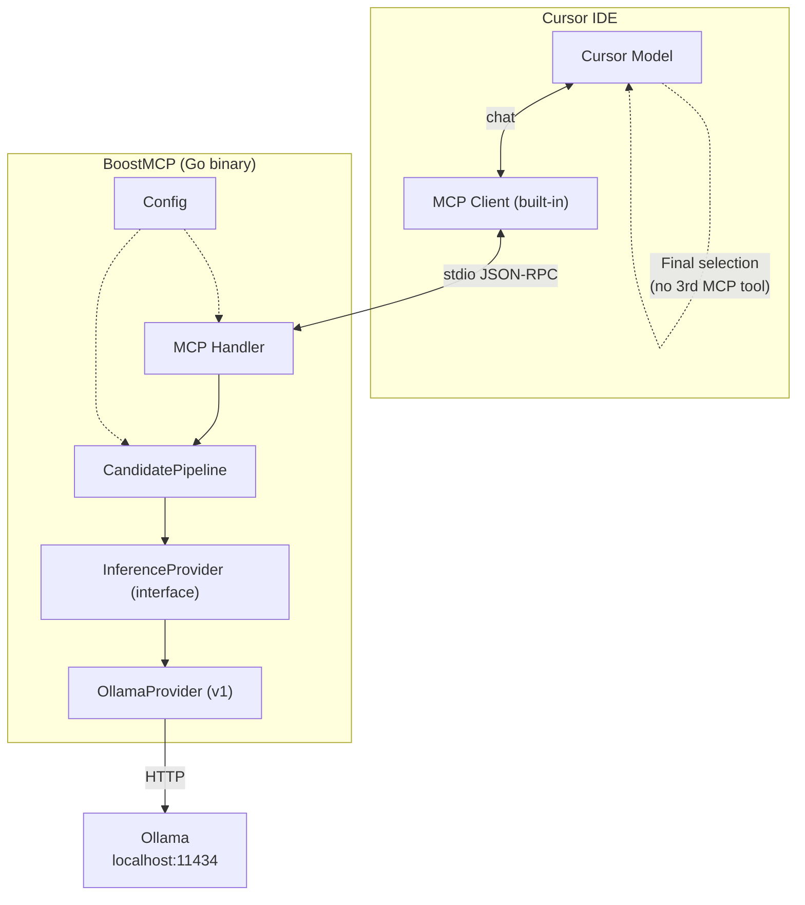
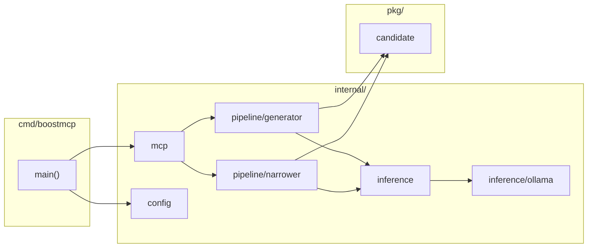
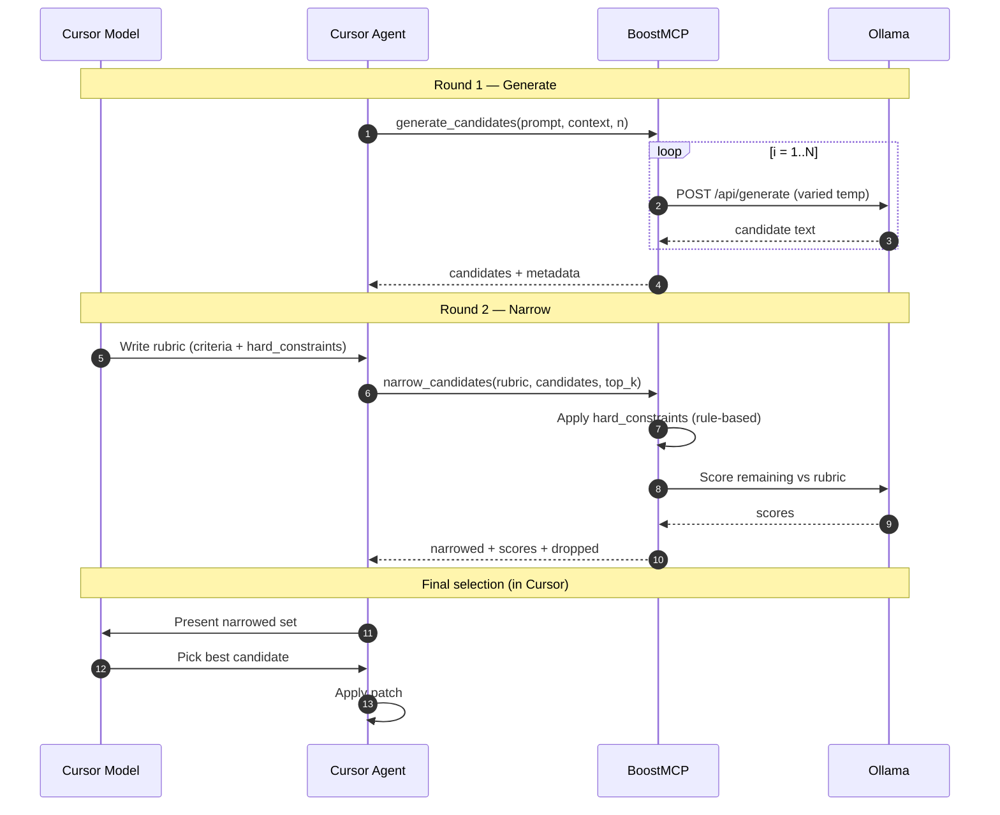
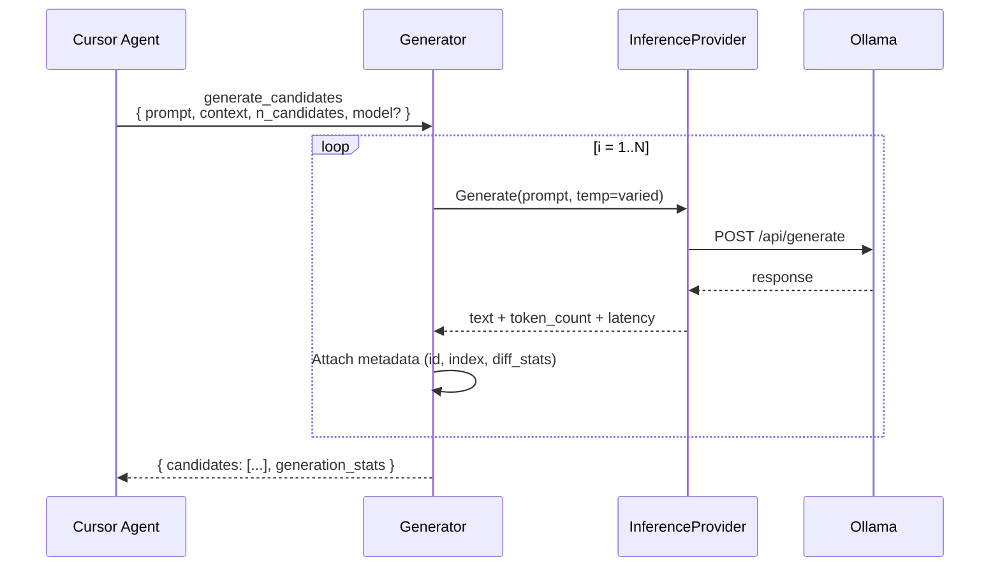
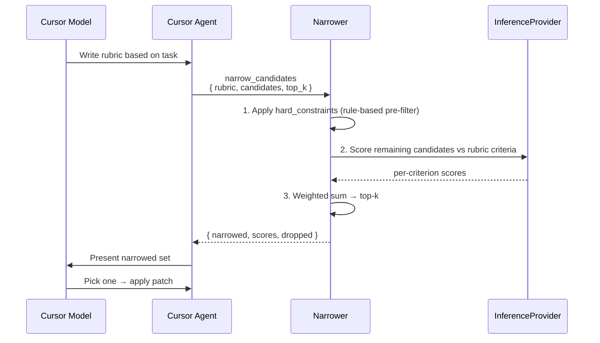
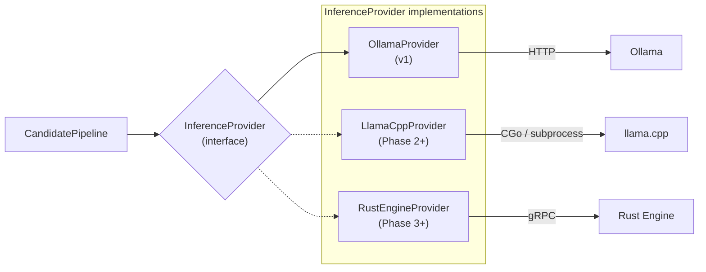
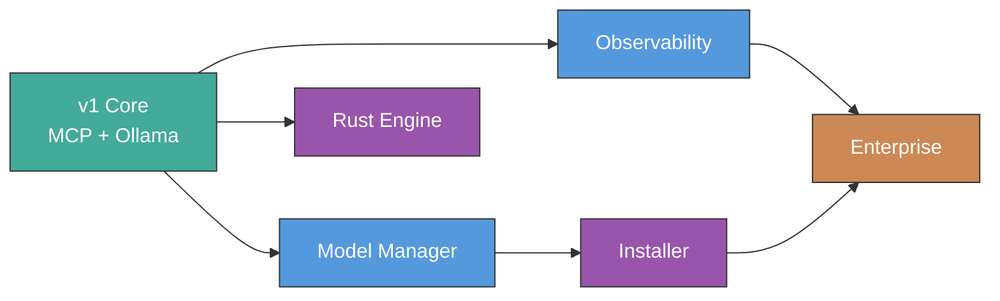

# BoostMCP v1 Design Specification

**Date:** 2026-05-26  
**Status:** Approved  
**Approved:** 2026-05-26  
**Author:** Brainstorming session

---

## 1. Executive Summary

BoostMCP is a local AI code co-processor exposed to Cursor via MCP (Model Context Protocol). It generates multiple code candidates using a local SLM, narrows them against a rubric supplied by the Cursor model, and returns the filtered set for final selection in Cursor chat.

**v1 scope:** Core MCP co-processor + pluggable inference (Ollama backend). Model manager, installer, and observability are deferred to Phase 2.

**Target user:** Solo developer running locally on Windows, macOS, or Linux, integrated with Cursor IDE.

---

## 2. Goals and Non-Goals

### Goals (v1)

- Expose MCP tools over `stdio` for Cursor integration
- Generate N code candidates via local SLM (Ollama)
- Accept structured rubric from Cursor model and narrow candidates to top-k
- Pluggable `InferenceProvider` interface for future engine swap (llama.cpp, Rust engine)
- Clear, actionable error messages when Ollama is unavailable or misconfigured

### Non-Goals (v1)

- Model download/management UI
- One-click installer or Cursor MCP auto-configuration
- Metrics, tracing, or structured observability stack
- Rust inference engine or gRPC IPC
- Enterprise features (SSO, audit log, central policy)
- Deterministic lint/test/typecheck as primary selection mechanism

---

## 3. Architecture

### 3.1 High-Level Diagram



### 3.2 Design Principles

| Plane | Responsibility | v1 Implementation |
|---|---|---|
| **Control plane** | Orchestration, policy, MCP tool contract | Go MCP Server |
| **Data plane** | SLM inference, tokenization, streaming | Ollama via `InferenceProvider` |
| **Selection plane** | Rubric authoring, final candidate pick | Cursor Model (in chat) |

### 3.3 Chosen Approach

**Approach 1 — Go monolith, MCP stdio** was selected over:

- **Approach 2** (Go + Rust engine from v1): rejected as over-engineering for solo-dev MVP
- **Approach 3** (thin wrapper, logic in Cursor rules): rejected as non-platform, hard to extend

---

## 4. Components



| Component | Path | Responsibility |
|---|---|---|
| Entry point | `cmd/boostmcp` | Parse flags/env, start MCP stdio server |
| MCP layer | `internal/mcp` | JSON-RPC handler, tool registration |
| Generator | `internal/pipeline/generator` | Call SLM N times, build candidate set |
| Narrower | `internal/pipeline/narrower` | Apply rubric, score and filter to top-k |
| Inference interface | `internal/inference` | `InferenceProvider` interface + factory |
| Ollama adapter | `internal/inference/ollama` | HTTP client for Ollama API |
| Config | `internal/config` | Model name, N, timeout, Ollama URL |
| Domain types | `pkg/candidate` | `Candidate`, `Rubric`, `Metadata` |

---

## 5. Two-Round Pipeline

### 5.0 End-to-End Flow



### 5.1 Round 1 — Generate



The generator varies temperature (or seed) across calls to produce diverse candidates. Each candidate receives a unique ID and metadata for downstream scoring.

### 5.2 Round 2 — Narrow



### 5.3 Rubric Format

The Cursor model produces structured JSON rubrics:

```json
{
  "criteria": [
    { "name": "correctness", "weight": 0.4, "description": "Code solves the stated problem correctly" },
    { "name": "minimal_diff", "weight": 0.3, "description": "Smallest change that achieves the goal" },
    { "name": "no_breaking_changes", "weight": 0.3, "description": "Does not break existing API or behavior" }
  ],
  "hard_constraints": ["must compile", "no new dependencies"]
}
```

**Hard constraints** are evaluated rule-based before SLM scoring (fast reject).  
**Weighted criteria** are scored via a single SLM call that evaluates all remaining candidates against the rubric.

---

## 6. MCP Tool Contract

### 6.1 Tool: `generate_candidates`

**Description:** Generate N diverse code candidates from a local SLM.

**Input schema:**

```json
{
  "type": "object",
  "properties": {
    "prompt": { "type": "string", "description": "Task description for code generation" },
    "context": { "type": "string", "description": "Optional file content or diff context" },
    "n_candidates": { "type": "integer", "minimum": 1, "maximum": 16, "default": 4 },
    "model": { "type": "string", "description": "Optional model override" }
  },
  "required": ["prompt"]
}
```

**Output schema:**

```json
{
  "candidates": [
    {
      "id": "cand-001",
      "content": "...",
      "metadata": {
        "index": 0,
        "model": "codellama:7b",
        "latency_ms": 1200,
        "token_count": 256
      }
    }
  ],
  "generation_stats": {
    "total_ms": 4800,
    "model": "codellama:7b",
    "requested": 4,
    "received": 4
  }
}
```

### 6.2 Tool: `narrow_candidates`

**Description:** Narrow a candidate set using a rubric. Returns top-k scored candidates.

**Input schema:**

```json
{
  "type": "object",
  "properties": {
    "rubric": {
      "type": "object",
      "properties": {
        "criteria": {
          "type": "array",
          "items": {
            "type": "object",
            "properties": {
              "name": { "type": "string" },
              "weight": { "type": "number", "minimum": 0, "maximum": 1 },
              "description": { "type": "string" }
            },
            "required": ["name", "weight", "description"]
          }
        },
        "hard_constraints": { "type": "array", "items": { "type": "string" } }
      },
      "required": ["criteria"]
    },
    "candidates": { "type": "array" },
    "top_k": { "type": "integer", "minimum": 1, "default": 2 }
  },
  "required": ["rubric", "candidates"]
}
```

**Output schema:**

```json
{
  "narrowed": [ "...candidate objects..." ],
  "scores": [
    {
      "candidate_id": "cand-001",
      "total_score": 0.87,
      "breakdown": {
        "correctness": 0.9,
        "minimal_diff": 0.85,
        "no_breaking_changes": 0.86
      }
    }
  ],
  "dropped": [
    {
      "candidate_id": "cand-003",
      "reason": "failed hard constraint: no new dependencies"
    }
  ]
}
```

---

## 7. InferenceProvider Interface

```go
type InferenceProvider interface {
    Generate(ctx context.Context, req GenerateRequest) (*GenerateResponse, error)
    ListModels(ctx context.Context) ([]ModelInfo, error)
    HealthCheck(ctx context.Context) error
    Name() string
}
```

### 7.1 v1 Implementation: OllamaProvider

- HTTP client targeting `http://localhost:11434` (configurable)
- Uses Ollama `/api/generate` endpoint
- Supports model override per request
- Health check via `GET /api/tags`

### 7.2 Future Implementations



| Provider | When | Transport |
|---|---|---|
| `LlamaCppProvider` | Phase 2+ | CGo bindings or subprocess |
| `RustEngineProvider` | Phase 3+ | gRPC over localhost TCP/UDS |

Provider selection is config-driven:

```yaml
inference:
  provider: ollama
  default_model: codellama:7b
  ollama_url: http://localhost:11434
  timeout_ms: 30000
  max_candidates: 16
```

---

## 8. Error Handling

| Scenario | Behavior |
|---|---|
| Ollama unreachable | MCP error: `"Ollama unreachable at {url}. Start Ollama first."` |
| Inference timeout | Cancel context; return partial results if ≥1 candidate succeeded |
| Zero candidates pass hard constraints | Return `narrowed: []` with `dropped` reasons; Cursor model decides retry |
| Invalid rubric JSON | Validation error immediately; no SLM call |
| Model not found | Error with suggestion to check available models |
| N candidates requested but M < N succeeded | Return M candidates + warning in `generation_stats` |

All errors include actionable messages for the Cursor agent. No silent failures.

---

## 9. Configuration

### 9.1 Environment Variables

| Variable | Default | Description |
|---|---|---|
| `BOOSTMCP_MODEL` | `codellama:7b` | Default SLM model |
| `BOOSTMCP_OLLAMA_URL` | `http://localhost:11434` | Ollama endpoint |
| `BOOSTMCP_TIMEOUT_MS` | `30000` | Inference timeout per call |
| `BOOSTMCP_MAX_CANDIDATES` | `16` | Upper bound for N |
| `BOOSTMCP_DEFAULT_TOP_K` | `2` | Default top-k for narrowing |

### 9.2 Config File (optional)

YAML config at `~/.config/boostmcp/config.yaml` overrides env defaults.

### 9.3 Cursor MCP Configuration

```json
{
  "mcpServers": {
    "boostmcp": {
      "command": "boostmcp",
      "args": []
    }
  }
}
```

---

## 10. Testing Strategy

| Layer | Method | Notes |
|---|---|---|
| `InferenceProvider` | Interface mock + integration test | Integration test skips if Ollama unavailable |
| `Generator` | Unit test with mock provider | Verify N candidates, metadata, temperature variation |
| `Narrower` | Unit test | Rubric parsing, hard constraint filter, mock SLM scoring |
| MCP tools | End-to-end stdio test | JSON-RPC harness sends tool calls, validates responses |
| Contract | Golden file test | Input/output schemas match documented contract |

---

## 11. Phase 2 Roadmap



| Feature | Description | Dependency |
|---|---|---|
| Model Manager | Download, list, switch models; VRAM budget | Core stable |
| Installer | Detect/install Ollama, auto-config Cursor MCP | Model Manager |
| Observability | Structured logs, Prometheus metrics, request tracing | Core stable |
| Rust Engine | `RustEngineProvider` via gRPC | Benchmark proves inference bottleneck |
| Enterprise | Policy engine, audit log, SSO | User segment expansion |

Phase 2 features attach to the Go server without changing the MCP tool contract.

---

## 12. Risks and Mitigations

| Risk | Impact | Mitigation |
|---|---|---|
| Ollama not installed/running | Tool unusable | Clear error message; Phase 2 installer |
| SLM scoring quality for narrowing | Poor top-k selection | Cursor model retains final pick authority |
| High latency with N=16 candidates | Slow UX | Default N=4; configurable; parallel generation |
| Rubric format inconsistency from Cursor model | Narrower fails | Strict JSON schema validation + error feedback |
| Go-only inference ceiling | Performance limit | `InferenceProvider` interface ready for swap |

---

## 13. Success Criteria (v1)

- [ ] Cursor connects to BoostMCP via stdio MCP without manual port configuration
- [ ] `generate_candidates` returns N diverse candidates with metadata
- [ ] `narrow_candidates` accepts rubric, returns scored top-k
- [ ] Ollama unreachable produces clear, actionable error
- [ ] `InferenceProvider` interface exists with Ollama implementation and mock for tests
- [ ] End-to-end test passes with Ollama running locally

---

## Appendix A: Decision Log

| Decision | Choice | Rationale |
|---|---|---|
| Primary goal | Full platform vision, v1 core only | Ship fast, extend later |
| Target user | Solo developer, local, Cursor | Simplest deployment model |
| Inference v1 | Pluggable interface, Ollama backend | Pragmatic; swap engine when proven necessary |
| Core value | Code co-processor with multi-candidate pipeline | Differentiated from thin Ollama wrapper |
| Selection model | Two-round: rubric → narrow → Cursor picks | Leverages Cursor model intelligence |
| Architecture | Go monolith, MCP stdio | Minimal complexity for v1 |
| Output format | Markdown spec (this document) | User preference |
| Spec status | Approved 2026-05-26 | User sign-off |
