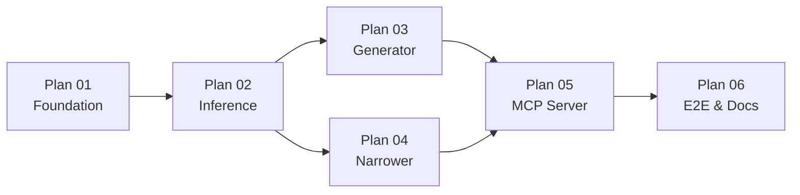

# BoostMCP v1 — Implementation Plans Index

> **Spec:** [`docs/superpowers/specs/2026-05-26-boostmcp-v1-design.md`](../specs/2026-05-26-boostmcp-v1-design.md) (Approved)

**Goal:** Ship v1 core — MCP co-processor with pluggable Ollama inference, candidate generation, and rubric narrowing.

**Strategy:** Six small plans, each producing working, testable software. Execute in order; Plans 03 and 04 can run in parallel after Plan 02.

---

## Plan Map

| # | Plan | Delivers | Est. tasks |
|---|---|---|---|
| 01 | [Foundation](./2026-05-26-plan-01-foundation.md) | Go module, config, domain types | 4 |
| 02 | [Inference Layer](./2026-05-26-plan-02-inference.md) | `InferenceProvider` + Ollama + mock | 5 |
| 03 | [Generator](./2026-05-26-plan-03-generator.md) | `generate_candidates` pipeline logic | 4 |
| 04 | [Narrower](./2026-05-26-plan-04-narrower.md) | `narrow_candidates` pipeline logic | 5 |
| 05 | [MCP Server](./2026-05-26-plan-05-mcp-server.md) | stdio MCP server, tool wiring | 4 |
| 06 | [E2E & Docs](./2026-05-26-plan-06-e2e-docs.md) | stdio integration test, README, Cursor config | 3 |

---

## Success Criteria (v1)

Mapped from spec §13:

| Criterion | Plan |
|---|---|
| `InferenceProvider` + Ollama + mock | 02 |
| `generate_candidates` returns N candidates + metadata | 03, 05 |
| `narrow_candidates` accepts rubric, returns top-k | 04, 05 |
| Ollama unreachable → actionable error | 02, 05 |
| Cursor connects via stdio MCP | 05, 06 |
| End-to-end test with Ollama | 06 |

---

## Tech Stack (all plans)

- **Language:** Go 1.22+
- **MCP SDK:** `github.com/mark3labs/mcp-go`
- **Inference backend (v1):** Ollama HTTP API
- **Testing:** `go test`, stdlib `net/http/httptest`
- **Config:** env vars + optional YAML (`gopkg.in/yaml.v3`)

---

## Known v1 Limitations

Documented in-plan; not blockers for shipping v1. Each gets a Phase 2 ticket.

| Area | Limitation | Plan |
|---|---|---|
| Narrower | Hard-constraint heuristics only catch `"no new dependencies"`; everything else is delegated to the SLM scorer | 04 |
| Narrower | All survivors scored in a single SLM call — context-window risk for N=16 long candidates | 04 |
| Narrower | No retry on unparseable score JSON | 04 |
| MCP server | No per-tool-call deadline (only per-inference timeout) | 05 |
| MCP server | No SIGINT graceful shutdown — Ctrl+C drops in-flight calls | 05 |
| MCP server | No request tracing/structured logs | 05 |
| Generator | Metadata has `diff_stats` reserved but never populated in v1 | 01, 03 |

---

## Execution Options

After reviewing plans, choose:

1. **Subagent-Driven** — fresh subagent per plan/task, review between tasks
2. **Inline Execution** — implement plan-by-plan in this session with checkpoints

Start with **Plan 01** regardless of approach.
