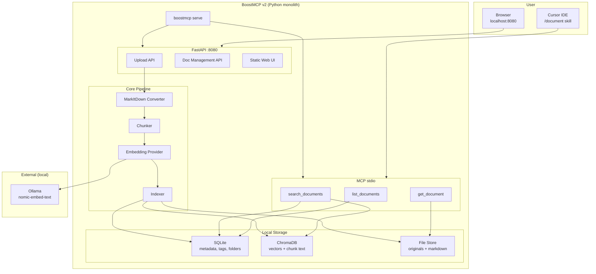
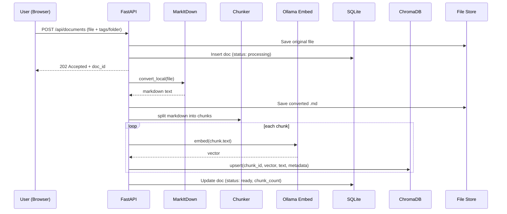
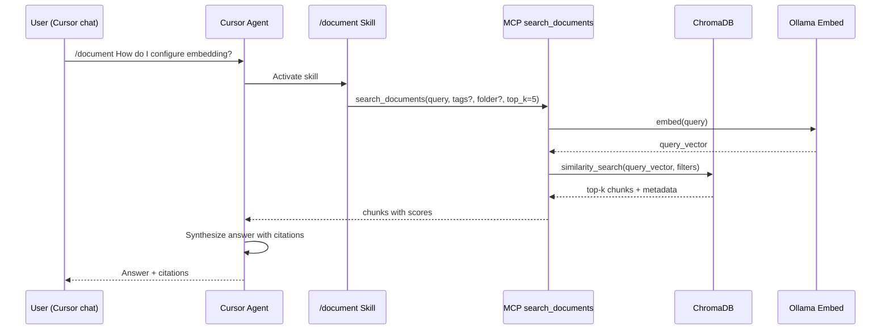

# BoostMCP v2 Design Specification — Document RAG

**Date:** 2026-05-26  
**Status:** Approved  
**Approved:** 2026-05-26  
**Author:** Brainstorming session  
**Replaces:** [BoostMCP v1 Design](2026-05-26-boostmcp-v1-design.md) (code co-processor)

---

## 1. Executive Summary

BoostMCP v2 is a **local document RAG server** for Cursor. Users upload files via a Web UI; the server converts them to Markdown, chunks and embeds them, and stores vectors locally. When the user asks questions in Cursor using the `/document` skill, the agent retrieves relevant chunks via MCP and answers with citations grounded in uploaded documents.

**v2 scope:** Python rewrite with FastAPI Web UI, MCP stdio tools, MarkItDown conversion, Ollama embedding (default), ChromaDB vector store, tag/folder organization, and a shipped Cursor Skill for `/document`.

**Target user:** Solo developer running locally on Windows, macOS, or Linux, integrated with Cursor IDE.

---

## 2. Goals and Non-Goals

### Goals (v2)

- Replace v1 code co-processor entirely with document RAG as core
- Web UI at `localhost:8080` for drag-and-drop upload and document management
- Support all major file types via [MarkItDown](https://github.com/microsoft/markitdown) (PDF, Office, images, audio, HTML, text, etc.)
- Single shared knowledge base with **tag/folder** organization and filterable search
- Hybrid embedding: **Ollama offline by default** (`nomic-embed-text`), optional cloud embedding via config
- MCP tools for semantic search; Cursor model synthesizes answers (no LLM in MCP)
- Ship a Cursor Skill (`/document`) defining search → read chunks → answer with citations
- Poetry for dependency management and reproducible installs

### Non-Goals (v2)

- Backward compatibility with v1 MCP tools (`generate_candidates`, `narrow_candidates`)
- Cloud hosting, multi-user auth, or LAN exposure
- Azure Document Intelligence / Content Understanding integration
- Upload via MCP tools (upload is Web UI only in v2)
- LLM answer synthesis inside MCP (retrieval only)
- Real-time collaborative editing
- One-click installer

---

## 3. Architecture

### 3.1 High-Level Diagram



### 3.2 Chosen Approach

**Approach 1 — Python monolith `serve`** was selected over:

- **Approach 2** (dual CLI: separate `mcp` and `web` processes): rejected because users would forget to start Web UI; Cursor only launches MCP
- **Approach 3** (LlamaIndex/LangChain framework): rejected as over-engineered for solo-dev MVP; heavy dependencies, less control

Runtime choice: **full Python rewrite** (replacing Go v1) to use MarkItDown natively, FastAPI for Web UI, and MCP Python SDK.

### 3.3 Process Model

Single command in Cursor `mcp.json`:

```json
{
  "mcpServers": {
    "boostmcp": {
      "command": "poetry",
      "args": ["run", "boostmcp", "serve"],
      "cwd": "/path/to/BoostMCP"
    }
  }
}
```

Alternative using venv binary directly (Windows):

```json
{
  "command": "C:/path/to/BoostMCP/.venv/Scripts/boostmcp.exe",
  "args": ["serve"]
}
```

On `boostmcp serve` startup:

1. Load config from env / `~/.boostmcp/config.yaml`
2. Initialize SQLite + ChromaDB + file store
3. Start FastAPI on `127.0.0.1:8080` (background thread/async task)
4. Run MCP stdio server on main thread (blocking — Cursor attaches here)
5. Log health warnings to stderr (Ollama reachable, embedding model installed)

---

## 4. Data Flow

### 4.1 Upload and Index



### 4.2 `/document` Query in Cursor



The MCP layer performs **retrieval only**. The Cursor model synthesizes the final answer using returned chunks. The skill enforces citation format and prohibits hallucination beyond retrieved content.

---

## 5. Components

### 5.1 Project Structure

```
boostmcp/
├── pyproject.toml              # Poetry
├── poetry.lock
├── boostmcp/
│   ├── __main__.py
│   ├── cli.py                  # boostmcp serve
│   ├── config.py
│   ├── web/
│   │   ├── app.py              # FastAPI routes
│   │   └── static/             # Web UI (HTML/CSS/JS)
│   ├── mcp/
│   │   └── server.py           # MCP tool registration
│   ├── ingest/
│   │   ├── converter.py        # MarkItDown wrapper (convert_local only)
│   │   ├── chunker.py
│   │   └── indexer.py
│   ├── embed/
│   │   ├── provider.py         # interface
│   │   ├── ollama.py
│   │   └── openai.py           # optional cloud
│   └── store/
│       ├── sqlite.py           # docs, tags, folders
│       ├── chroma.py           # vector search
│       └── files.py            # original + markdown files
├── skills/
│   └── document/
│       └── SKILL.md            # Cursor /document skill
└── tests/
```

### 5.2 Runtime Data Directory

```
~/.boostmcp/
├── config.yaml
├── data.db                     # SQLite
├── chroma/                     # ChromaDB persist
└── files/
    ├── originals/              # uploaded files
    └── markdown/               # converted .md
```

### 5.3 MCP Tools

| Tool | Description |
|------|-------------|
| `search_documents` | Semantic search. Args: `query` (required), `tags` (optional array), `folder` (optional string), `top_k` (optional, default 5) |
| `list_documents` | List indexed documents. Args: `tags`, `folder`, `status` (optional filters) |
| `get_document` | Get full markdown or metadata for one document. Args: `doc_id` (required) |

### 5.4 Web UI (v2 scope)

Single-page UI without heavy frontend framework:

- **Upload zone** — drag-and-drop; select folder and tags before upload
- **Document list** — filename, folder, tags, status (processing/ready/error), chunk count
- **Actions** — delete document, re-index, edit tags/folder
- **Health panel** — Ollama status, embedding model availability

### 5.5 Chunk Metadata

Each chunk stored in ChromaDB with metadata mirrored in SQLite:

| Field | Example |
|-------|---------|
| `doc_id` | `doc_abc123` |
| `filename` | `spec-v2.pdf` |
| `folder` | `BoostMCP` |
| `tags` | `["design", "v2"]` |
| `chunk_index` | `3` |
| `source_page` | `5` (when MarkItDown provides it) |

---

## 6. Configuration

Config load order: **environment variables** → **`~/.boostmcp/config.yaml`** → defaults.

```yaml
# ~/.boostmcp/config.yaml
server:
  web_host: "127.0.0.1"
  web_port: 8080

storage:
  data_dir: "~/.boostmcp"

embedding:
  provider: "ollama"              # ollama | openai
  ollama_url: "http://localhost:11434"
  ollama_model: "nomic-embed-text"
  openai_api_key: ""              # only when provider=openai
  openai_model: "text-embedding-3-small"

ingest:
  chunk_size: 512                 # approximate tokens (chars/4)
  chunk_overlap: 64
  max_file_size_mb: 50

search:
  default_top_k: 5
  min_score: 0.3                  # filter low-relevance chunks
```

| Env Variable | Default | Description |
|---|---|---|
| `BOOSTMCP_DATA_DIR` | `~/.boostmcp` | Data directory |
| `BOOSTMCP_WEB_PORT` | `8080` | Web UI port |
| `BOOSTMCP_EMBED_PROVIDER` | `ollama` | `ollama` or `openai` |
| `BOOSTMCP_OLLAMA_URL` | `http://localhost:11434` | Ollama endpoint |
| `BOOSTMCP_OLLAMA_EMBED_MODEL` | `nomic-embed-text` | Embedding model |
| `BOOSTMCP_OPENAI_API_KEY` | — | Required when provider=openai |
| `BOOSTMCP_CHUNK_SIZE` | `512` | Chunk size |
| `BOOSTMCP_MAX_FILE_MB` | `50` | Upload size limit |

---

## 7. Embedding Provider

### 7.1 Interface

```python
class EmbeddingProvider(Protocol):
    async def embed(self, texts: list[str]) -> list[list[float]]: ...
    async def health_check(self) -> None: ...
```

### 7.2 Ollama (default)

- Model: `nomic-embed-text` (768 dimensions)
- Endpoint: `POST {ollama_url}/api/embed`
- Fully offline; no API key required

### 7.3 OpenAI (optional)

- Activated when `embedding.provider=openai` and `OPENAI_API_KEY` is set
- Model: `text-embedding-3-small` (configurable)
- Requires internet

---

## 8. Error Handling

### 8.1 Document Status

| Status | Meaning |
|--------|---------|
| `processing` | Converting, chunking, or embedding in progress |
| `ready` | Indexed and searchable |
| `error` | Failed — `error_message` stored and shown in Web UI |

### 8.2 Error Behavior by Step

| Step | Error | Behavior |
|------|-------|----------|
| Upload | File too large or unsupported type | HTTP 413/415; file not saved |
| MarkItDown | Corrupt PDF, missing dependency | `status=error` with message on Web UI |
| Embed | Ollama unavailable | Retry 3 times, then `status=error`; Web UI shows warning |
| Search (MCP) | Ollama unavailable | Tool returns actionable error: *"Start Ollama and run: ollama pull nomic-embed-text"* |
| Search | No results | Returns empty array with message: *"No documents matched. Upload at http://localhost:8080"* |

### 8.3 Startup Health Check

Logged to stderr; does not block startup:

- Is Ollama reachable?
- Is embedding model installed?
- Are ChromaDB and SQLite writable?

Server starts even if Ollama is down. Upload works; search fails until Ollama is available.

---

## 9. Security (Local-Only)

v2 assumes solo developer on localhost:

- FastAPI binds `127.0.0.1` only — not exposed to LAN
- No authentication on Web UI (acceptable for localhost-only)
- MarkItDown uses `convert_local()` exclusively — no remote URL fetching
- Validate file extension and magic bytes before conversion
- Sanitize filenames on disk

Future phase: API key auth if network exposure is needed.

---

## 10. Cursor Skill — `/document`

Shipped at `skills/document/SKILL.md`. User installs to `~/.cursor/skills/` or project `.cursor/skills/`.

Skill-defined flow:

1. Detect message starting with `/document`
2. Parse query (strip `/document` prefix)
3. Parse optional filters: `--tag design`, `--folder BoostMCP`
4. Call MCP `search_documents` with `top_k=5`
5. If zero results, tell user to upload docs at `http://localhost:8080`
6. Answer **only from retrieved chunks** — do not hallucinate
7. Citation format: `[filename, chunk N]` or `[filename, p.X]` when page metadata exists

---

## 11. Migration from Go v1

Breaking change — no backward compatibility.

| Action | Detail |
|--------|--------|
| Remove Go code | `internal/`, `cmd/boostmcp`, `pkg/candidate`, `go.mod`, `go.sum` |
| Keep and rewrite | `README.md`, `docs/` |
| Archive v1 docs | Move v1 spec and plans to `docs/archive/v1/` |
| New stack | Python 3.10+, Poetry, FastAPI, MCP SDK, MarkItDown, ChromaDB |
| MCP config | Update `mcp.json` to `poetry run boostmcp serve` |
| Prerequisites | Poetry, Ollama, `ollama pull nomic-embed-text` |

No data migration from v1 — v1 had no persistent document store.

---

## 12. Dependencies (Poetry)

```toml
[tool.poetry]
name = "boostmcp"
version = "2.0.0"
description = "Local document RAG server for Cursor via MCP"
packages = [{ include = "boostmcp" }]

[tool.poetry.dependencies]
python = "^3.10"
fastapi = "^0.115"
uvicorn = { extras = ["standard"], version = "^0.34" }
mcp = "^1.0"
markitdown = { extras = ["all"], version = "^0.1" }
chromadb = "^0.6"
httpx = "^0.28"
pyyaml = "^6.0"
python-multipart = "^0.0.20"

[tool.poetry.group.dev.dependencies]
pytest = "^8.0"
pytest-asyncio = "^0.25"

[tool.poetry.extras]
openai = ["openai"]

[tool.poetry.scripts]
boostmcp = "boostmcp.cli:main"

[build-system]
requires = ["poetry-core"]
build-backend = "poetry.core.masonry.api"
```

### Install and Run

```bash
poetry install
poetry install -E openai          # optional cloud embedding
ollama pull nomic-embed-text
poetry run boostmcp serve
```

---

## 13. Testing Strategy

| Layer | Method |
|-------|--------|
| Unit | Chunker, config parser, metadata filter logic |
| Integration | MarkItDown convert on sample PDF, docx, md files |
| Embed | Mock Ollama HTTP or skip when Ollama unavailable |
| MCP | Test `search_documents` against seeded ChromaDB |
| E2E | Upload via API → search via MCP → verify chunk content |
| Web UI | Manual smoke test: drag-drop, list, delete |

```bash
poetry run pytest tests/
poetry run pytest tests/ -m integration   # requires Ollama
```

---

## 14. Phase 2 (Deferred)

- MCP upload tool for agent-driven ingestion
- Hybrid search (BM25 + vector)
- Re-index on embedding model change
- Document versioning
- OCR plugin (`markitdown-ocr`) with local vision model
- Metrics and structured logging
